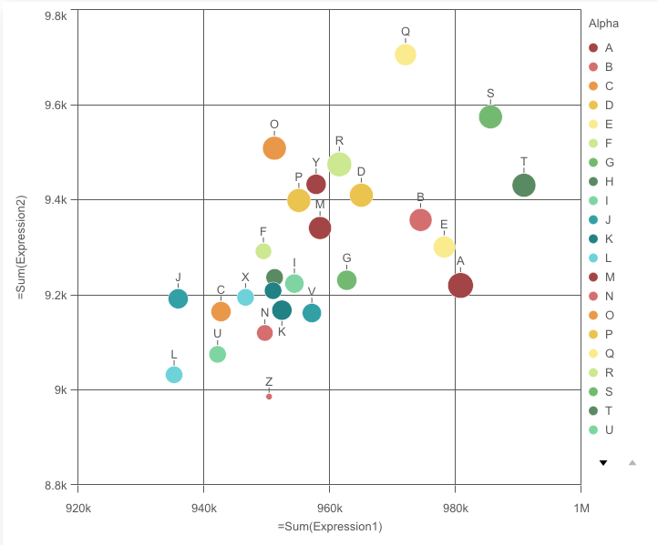
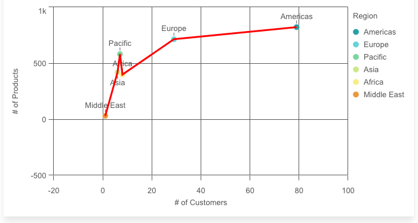
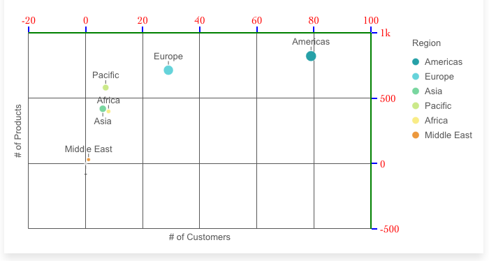

[](https://circleci.com/gh/qlik-oss/sn-scatter-plot)
[](https://codeclimate.com/github/qlik-oss/sn-scatter-plot/maintainability)
[](https://codeclimate.com/github/qlik-oss/sn-scatter-plot/test_coverage)

# sn-scatter-plot

## A scatter plot for nebula.js.

The scatter plot uses bubbles or dots to represent values of two or three measures over a dimension. The first measure is for bubble's position on the horizontal axis, the second measure is for the bubble's position on the vertical axis, and the third measure (if any) is for the bubble's size. The scatter plot is normally used to observe relationships among measures.



## Requirements

Requires `@nebula.js/stardust` version `1.2.0` or later.

## Installing

If you use npm: npm install @nebula.js/sn-scatter-plot. You can also load through the script tag directly from [https://unpkg.com](https://unpkg.com/@nebula.js/sn-scatter-plot).

## Usage

```js
import { embed } from '@nebula.js/stardust';
import scatterplot from '@nebula.js/sn-scatter-plot';

// 'app' is an enigma app model
const nuked = embed(app, {
  types: [
    {
      // register the scatterplot
      name: 'scatterplot',
      load: () => Promise.resolve(scatterplot),
    },
  ],
});

// Rendering a scatter plot on the fly
nuked.render({
  type: 'scatterplot',
  element,
  fields: ['Alpha', '=Sum(Expression1)', '=Sum(Expression2)', '=Sum(Expression3)'],
  options: {
    direction: 'ltr',
    freeResize: true,
  },
  properties: {
    color: { mode: 'byDimension' }, // overrides default properties
  },
});
```

## Options

- direction - ltr/rtl
- freeResize - in conjunction with snapshotData on layout, lets the chart ignore size set on snapshotData

## Scatter plot plugins

A plugin can be passed into a scatter plot to add or modify its capability
or visual appearance.
A plugin needs to be defined before it can be rendered together with the chart.

```js
// Step 1: define the plugin
const pointPlugin = {
  info: {
    name: 'point-plugin',
    type: 'component-definition',
  },
  fn: ({ layout, keys }) => {
    const componentDefinition = {
      key: keys.COMPONENT.POINT,
      type: 'point',
      settings: {
        strokeWidth: '2px',
        stroke: 'black',
        size: (d) => getSizeInLogarithmScale(d, layout),
        fill: (d) => getColorBasedOnMedian(d),
      },
    };
    return componentDefinition;
  },
};

// Step 2: passing the plugin definition into the render function
nuked.render({
  type: 'scatterplot',
  element: document.querySelector('.scatterplot'),
  properties: chartProperties,
  plugins: [pointPlugin],
});
```

The plugin definition is an object, with two properties `info` and `fn`.
The `fn` returns a `picasso.js` component. To build this component,
some important chart internals are passed into the argument object of `fn`.

```js
// Structure of the argument object of fn
const pluginArgs = {
    layout,
    keys: {
      SCALE:
        X,
        Y,
      },
      COMPONENT: {
        X_AXIS,
        Y_AXIS,
        POINT,
      },
    },
  };
```

With plugins, you can either add new components or modify existing components
of the scatter plot.

### Add new components

For example, a line component can be added on top of a scatter plot
to highlight the slopes between data points.



```js
// Definition of the line plugin
const linePlugin = {
  info: {
    name: 'line-plugin',
    type: 'component-definition',
  },
  fn: ({ keys }) => {
    const componentDefinition = {
      key: 'new-linecomp',
      type: 'line',
      data: {
        extract: {
          field: 'qDimensionInfo/0',
          props: {
            x: { field: 'qMeasureInfo/0' },
            y: { field: 'qMeasureInfo/1' },
          },
        },
        sort: (a, b) => (a.x.value > b.x.value ? 1 : -1), // sort ascending
      },
      settings: {
        coordinates: {
          minor: {
            scale: keys.SCALE.Y,
            ref: 'y',
          },
          major: {
            scale: keys.SCALE.X,
            ref: 'x',
          },
        },
        layers: {
          line: {
            stroke: 'red',
            strokeWidth: 3,
          },
        },
      },
    };
    return componentDefinition;
  },
};
```

### Modify existing components

As an example, the positions and the appearance of the axes can be
modified completely by plugins.



To overide an existing component, `fn` should returns a `picasso.js` component
that has the same `key` as the existing component (`key: 'x-axis'` in
this example)

```js
// Definition of the x-axis plugin
const xAxisPlugin = {
  info: {
    name: 'x-axis-plugin',
    type: 'component-definition',
  },
  fn: ({ keys }) => {
    const componentDefinition = {
      type: 'axis',
      key: keys.COMPONENT.X_AXIS,
      layout: {
        dock: 'top',
      },
      settings: {
        labels: {
          fontFamily: 'Cambria, Cochin, Georgia, Times, "Times New Roman", serif',
          fontSize: '15px',
          fill: 'red',
        },
        line: { stroke: 'green', strokeWidth: 2 },
        ticks: { stroke: 'blue', strokeWidth: 2 },
      },
    };
    return componentDefinition;
  },
};

// y-axis plugin can be defined with similar code
// ...
```

More details can be found in the `examples` folder.

### Plugins disclaimer

- The plugins API is still experimental.
- We can not guarantee our charts to be compatible with all different settings, especially when modifying existing components.
