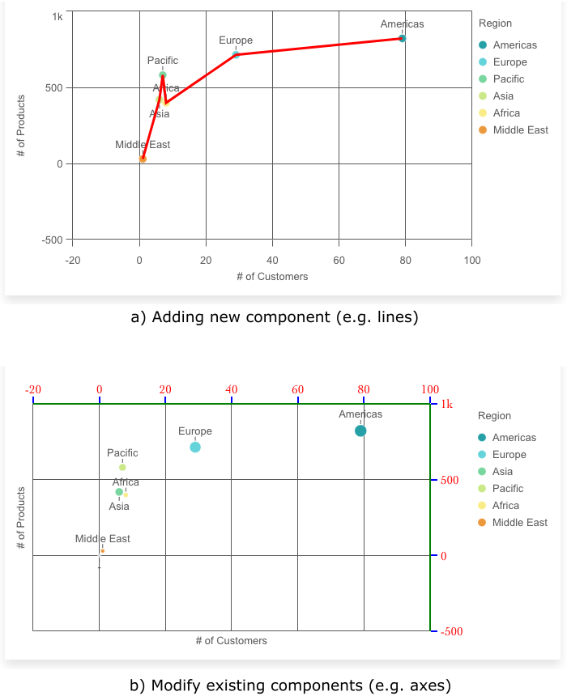

# Plugin examples

Demonstrating creating new `component-definition` or overriding/extending `component-definition` that are already available in `sn-scatter-plot`.

## Run

Copy path of one the `*.html` files and paste it to your browser.

## Chart internals testing

The properties used in the examples.

| Property             | Value            | Point | Axes | Line |
| -------------------- | ---------------- | ----- | ---- | ---- |
| Scale key            | "x"              |       |      | x    |
| Scale key            | "y"              |       |      | x    |
| Component key        | "x-axis"         |       | x    |      |
| Component key        | "y-axis"         |       | x    |      |
| Component key        | "point"          | x     |      |      |
| Data property: x     | { value, label } |       |      | x    |
| Data property: y     | { value, label } |       |      |      |
| Data property: size  | { value, label } | x     |      |      |
| Data property: value | Number           |       |      |      |
| Data property: label | String           |       |      |      |
| Layout               | Object           | x     |      |      |
